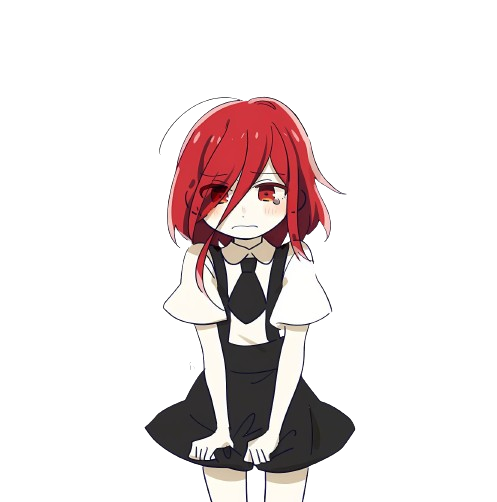

## Hi there, I'm Samuel Hutauruk

Hi, I'm not a software engineer nor a network engineer

- 🗣 Pronounce he/him
- 💙 Static Programming Language
- 🌱 Learning Computer Science
- 📚 Studying Informatics and Computer Engineering
- ✅ FreeBSD, Open Source, Linux
- 🎵 Rock, Pop, Country, Ballad

Best Quotes:  
  
"What really matters is curiosity, consistency, and a willingness to learn and build stuff."  
     —*ChatGPT*  
  
Checkout: [Name Card](https://samuelhutauruk2.github.io) - [LinkedIn](https://linkedin.com/in/samuelhutauruk2)  
